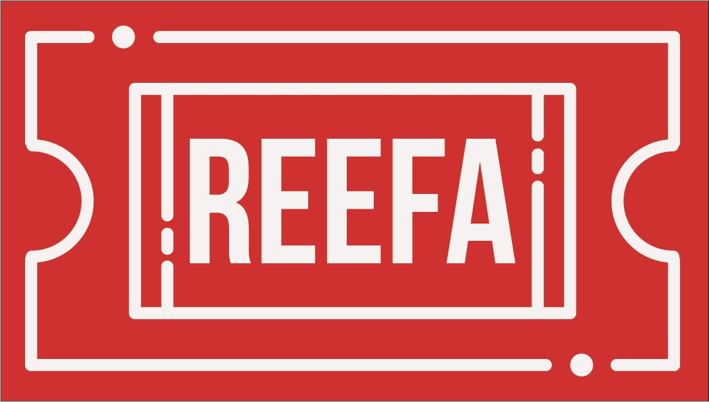

---

This repository contains the Reefa source code. Reefa is a tool that allows you to choose a random winner from a meetup.com event. It should be useful for Meetup organizers doing raffles and giveaways.

## Link

You can use Reefa in www.reefa.me

## How it works

A quick example of how Reefa works:

<ol>
<li> <h3>Connect to your Meetup.com account</h3> When you authenticate Reefa will comunicate with Meetup API and it will pull your meetup groups.
 </li>

 <li><h3>Select Meetup and Event</h3> Once you choose a group, Reefa will get the last 5 events of that group. When you choose the event, Reefa will show you a roulette with the images of the attendees at this event.</li>

<li> <h3>Reefa will choose a random winner</h3> When you click START the Reefa roulette will start to spin, and it will stop when it finds the random winner.</li>
</ol>
